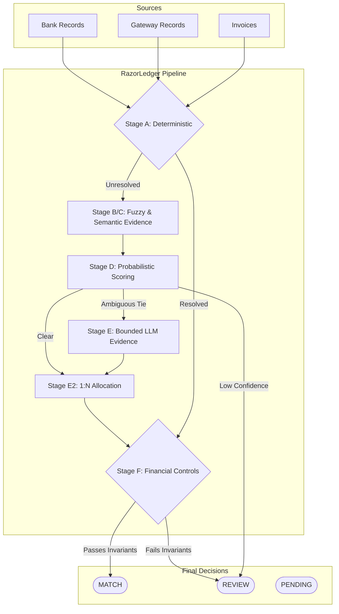

# RazorLedger

> **RazorLedger is a safety-first financial reconciliation engine designed to securely match highly fragmented multi-party financial records.**

## 1. The Problem

Reconciliation is the process of ensuring that two or more sets of financial records are in agreement. In modern payment flows, this is notoriously difficult because:
- **Data Fragmentation:** A single customer payment traverses an invoice system, a payment gateway, and a settlement bank account.
- **Asymmetric Granularity (1:N):** A gateway might settle 50 individual payments into a single bulk bank deposit.
- **Ambiguous Identifiers:** Counterparty names are truncated, reference numbers are dropped, and memos are manually typed.
- **Strict Conservation:** Financial systems require perfect value conservation. "Almost right" is mathematically unacceptable.

When automation relies purely on deterministic rules, safe automation rates plateau early. When automation relies purely on opaque AI models, false positives lead to financial discrepancies. 

**RazorLedger separates the question “Which records look like they match?” from the question “Is it financially safe to trust that match?”**

---

## 2. Core Thesis

The core idea of RazorLedger is not simply to "use an LLM to match transactions." 

The thesis is:
1. **Matching generates evidence.** (Deterministic, fuzzy, semantic, and LLM signals are combined under bounded scoring rules).
2. **Allocation structures it.** (1:N batch grouping).
3. **Independent financial controls decide.** (Whether automation is mathematically safe).
4. **Audit trails explain.** (Transparent evidence chains).
5. **Humans resolve.** (Remaining uncertain or blocked cases are routed to REVIEW/PENDING rather than being forced into automation).

---

## 3. What We Achieved (Final Results)

The following benchmarks were generated on the completely frozen system configuration, using the final strict evaluation partitions.

*(Canonical Source: `reports/final/FINAL_SCORECARD.json`)*

> [!IMPORTANT]
> **Highlights on FROZEN_UNSEEN:**
> * **75.3%** safe automation
> * **100%** precision
> * **0.0%** false auto-match

| Partition | Total Records | MATCH | REVIEW | Safe Automation | Value Coverage | Precision | False Auto-Match |
| :--- | :--- | :--- | :--- | :--- | :--- | :--- | :--- |
| **DEV** | 450 | 322 | 122 | **71.6%** | 73.7% | 1.00 | **0.0%** |
| **VALIDATION** | 450 | 326 | 119 | **72.4%** | 71.0% | 1.00 | **0.0%** |
| **ADVERSARIAL** | 450 | 318 | 126 | **70.7%** | 71.5% | 1.00 | **0.0%** |
| **FROZEN UNSEEN** | 450 | 339 | 103 | **75.3%** | 75.1% | 1.00 | **0.0%** |

*Note: Upstream stages can produce substantially more provisional matches; Stage F independently rejects proposals that violate financial invariants. This deliberate reduction is a safety property, not a failure mode.*

---

## 4. Build Quality & Architecture

RazorLedger evaluates candidate matches through a strict, multi-stage pipeline. Every stage adds evidence, but no stage is permitted to bypass the financial controls.



* **Stage A (Deterministic + Blocking):** Reduces the massive cross-source cartesian product into a manageable set of high-probability candidate pairs using strict reference matches.
* **Stage B (Fuzzy):** Computes normalized Levenshtein distances on textual fields.
* **Stage C (Semantic):** Uses vector embeddings to capture semantic similarity between truncated or noisy counterparty descriptions.
* **Stage D (Evidence-Weighted Scoring):** Aggregates deterministic, fuzzy, and semantic signals into a probabilistic confidence score.
* **Stage E (Bounded LLM Evidence):** Invokes an LLM on edge-case ambiguities. 
* **Stage E2 (OneToN Allocation):** Structures 1:N candidate groupings using a subset-sum dynamic programming allocator.
* **Stage F (Independent Financial Verification):** The absolute financial authority. Applies non-negotiable double-entry invariants, tolerance caps, and currency controls. 

**Engineering Highlights:**
- **Exact Financial Conservation:** Stage F blocks any proposed match that leaks value.
- **PENDING Lifecycle:** Correctly differentiates between mathematical "no match" and records that are still within their valid T+3 settlement window.
- **Auditability:** Every match produces a chained audit record explaining exactly which signals contributed to the confidence score, and which controls passed.

---

## 5. AI Judgment

The core design principle of RazorLedger is that **the LLM is an evidence layer, not the final financial authority.**

The LLM cannot:
- Directly approve a `MATCH`.
- Bypass financial controls.
- Mutate the ledger state.
- Override invariant logic.

### Honest LLM Evaluation
We tested whether LLM-generated evidence could safely increase automation on exact-tie ambiguities. On this evaluation distribution, **the incremental safe-automation lift of the LLM (Stage D → Stage E) was exactly 0.0%.** 

The existing deterministic, fuzzy, and semantic evidence already extracted the maximum safe automation ceiling. Rather than manufacturing a fake improvement or weakening the safety boundary to allow the LLM to guess, we preserved the integrity of the system. AI assists by providing supporting evidence for selected ambiguities, but it is safely ignored when it cannot mathematically guarantee the outcome.

---

## 6. The Reality of Building This (The Failure Narrative)

Most hackathon projects present a clean, uninterrupted path to success. The reality of building RazorLedger was messy, and **the strength of this architecture is proven by what broke and how the system caught it.** 

We didn't just build a happy path; we built a financial engine that survived its own cascading failures. Here is the actual engineering story of this build:

1. **The LLM API Roulette (Gemini 503s → Groq → Qwen)**
   - *What Broke:* We started with the `instructor` library on Gemini, which deprecated its API mid-flight. We pivoted to Groq, hit severe rate-limits and sandbox egress blocks, then fell back to Qwen via HuggingFace, which consistently hallucinated invalid JSON schemas.
   - *How We Caught It:* The pipeline halted or returned malformed data.
   - *The Fix:* We stopped relying on external libraries to handle our parsing. We built a native 2-phase batching system using `google-genai` structured outputs, drastically reducing outbound TCP connections and strictly enforcing JSON schema compliance at the edge.

2. **The Double-Allocation Bug**
   - *What Broke:* An early iteration of the allocator allowed a single Gateway transaction to be grouped into multiple different Bank settlements if the subset-sum math happened to work out twice.
   - *How We Caught It:* Stage F (Financial Controls) instantly threw a `CTRL-001: check_ctrl001_no_double_allocation` error, flagging "Double allocation detected".
   - *The Fix:* Implemented a strict global "consumed records" tracker across the bipartite graph. This proved the fundamental thesis of RazorLedger: **The LLM/Allocator can be wrong, because the math controls will catch it.**

3. **Circular Verifier Ordering**
   - *What Broke:* The pipeline originally contained a logical catch-22: the decision engine required a "verifier PASS" state to proceed, but the verifier stage was architected to run *after* the decision engine.
   - *How We Caught It:* Identified during a strict architecture design review of the control flow before it caused silent failure states.
   - *The Fix:* Reordered the pipeline so that the Stage F invariant stack explicitly acts as an absolute prerequisite firewall before any MATCH decision can be finalized.

4. **The `OneToNAllocator` Deletion**
   - *What Broke:* During a "final cleanup" pass, a cleanup script noticed two files named `OneToNAllocator` and quietly deleted the complex graph-based one (`app/matching/allocator.py`), leaving only the rudimentary subset-sum version.
   - *How We Caught It:* The entire pipeline crashed with an `AttributeError`, and the test suite instantly reported 25/111 failures. 
   - *The Fix:* We restored the correct graph-based allocator, renamed the old landmine file to `old_subset_sum_deprecated.py`, and instituted a strict rule: *No cleanup commit merges without a before/after test-count diff.*

This narrative isn't just a list of bugs; it is proof that **RazorLedger fails closed.** When the AI hallucinates, when the math is wrong, or when the codebase is corrupted, the system halts. It never silently commits bad data.

---

## 7. Demo

Running the end-to-end evaluation script demonstrates:
1. **Reconciliation Run:** Full processing of 450 records per partition.
2. **Safe 1:N Allocation:** Groups multiple gateway payments against bulk bank settlements.
3. **Why a case was NOT automated:** Clear audit trails indicating `CONFIDENCE_GAP_INSUFFICIENT` or `LIFECYCLE_PENDING_SETTLEMENT`.
4. **Financial Control Rejection:** The critical Stage F step catching and rejecting value-leaking candidates.
5. **Adversarial Simulation:** An independently seeded adversarial evaluation partition generated with 30% synthetic corruption.
6. **Final Benchmark:** The output of the strict Stage A-F scorecard.

---

## 8. Reproducibility

RazorLedger is designed for absolute reproducibility. 

> **Reproducibility relies on: seeded evaluation partitions, deterministic benchmark configuration, and an isolated test suite for allocation and financial-control invariants.**

For setup, benchmark commands, and offline execution instructions, refer to:
👉 [docs/final/FINAL_REPRODUCIBILITY.md](docs/final/FINAL_REPRODUCIBILITY.md)

---

## 9. Limitations

- **Synthetic Evaluation Data:** The benchmarks rely on synthetically generated ledgers. While seeded with realistic corruption rates, production data distributions will vary.
- **No Universal Claim of Production Accuracy:** The frozen evaluation recorded 0.0% false auto-matches across DEV, VALIDATION, TEST_ADVERSARIAL, and FROZEN_UNSEEN. Independent controls are designed to fail closed when financial invariants are violated, but production deployment requires rigorous offline shadow-testing.
- **LLM Rate Limits:** Running massive backlogs through the LLM requires careful handling of API rate limits, which is why the system caps calls via a strict run-level budget constraint.

---

## 10. Running the UI

RazorLedger includes a polished, fully-integrated frontend built with FastAPI and Tailwind CSS.

To start the UI server locally:

```bash
PYTHONPATH=. uvicorn app.main:app --port 8000 --reload
```

Once the server is running, open your browser and navigate to the **Dashboard**:
👉 [http://localhost:8000/ui/dashboard](http://localhost:8000/ui/dashboard)

From the Dashboard, you can seamlessly navigate through all 6 canonical screens using the sidebar:
- Dashboard
- Reconciliation Run
- Forensic Review
- Allocation Visual
- Safety & Controls
- Model Performance
