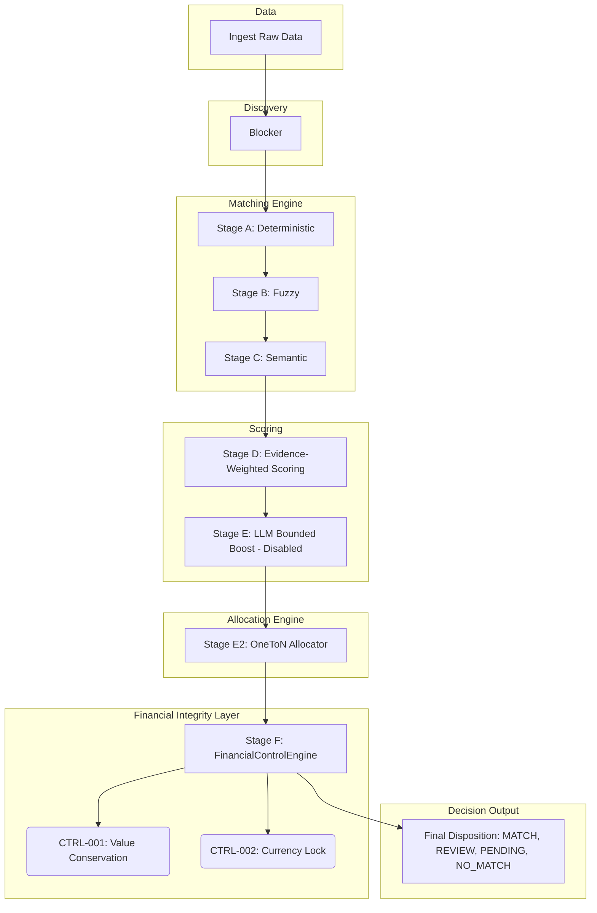

# RazorLedger Final Architecture

**Date:** 2026-08-24
**Version:** Final Freeze (Phase 7)

## Overview
RazorLedger implements a multi-stage reconciliation pipeline that isolates matching heuristics from financial invariants. It prevents matching logic bugs from causing financial errors.

## Pipeline Architecture (Stages A-F)

## Key Architectural Decisions

1. **Independent Verification (Stage F)**
   The Matching Engine constructs hypotheses. It has no authority to alter state. The `FinancialControlEngine` acts as an independent auditor that evaluates the proposed `ReconciliationGroup`. If any control fails, the candidate is instantly demoted to `REVIEW`.
2. **Strict 1:N Allocation (Stage E2)**
   Sequential pairwise matching fails structurally for multi-line transactions (like splitting an invoice payment). The `OneToNAllocator` consumes pairwise candidate edges and explicitly resolves bipartite connected components into strictly verified 1:N groups, maintaining the invariants needed by `CTRL-001`.
3. **Evidence-Weighted Scoring (Stage D)**
   Replaces naive heuristic thresholds with an objective, data-driven scoring system based on attribute rarity. A match on a globally unique invoice ID carries significantly more mathematical weight than a match on a generic string like "Payment".
4. **Bounded AI (Stage E)**
   Generative AI cannot make final financial decisions. The LLM is confined to a strictly bounded scoring box (`max_boost = +0.10`). If the LLM hallucinates, the Financial Control Engine still blocks the mismatch. (Note: LLM proved unnecessary and was disabled in the final run).
